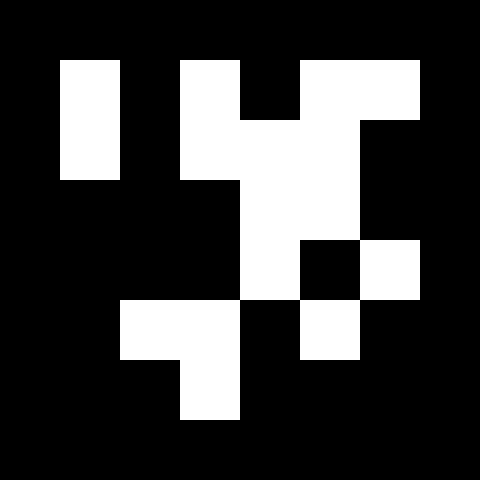

# README 

ARgus' architecture is the following:

This repository contains four Unity projects: 
- **1.** one to build the desktop user's application for the remote setup 
- **2.** one to build the hololens user's application for the local setup
- **3.** two acting as a single server for 1. and 2. to connect, for the local setup

## Desktop user's application

This application is built from the Unity project in the `desktop` folder. The Unity version should be the `2019.4.0f1`. The main scene is `Assets/Scenes/ar-remote-participant/SampleScene`.

The build configuration in Unity is:
<table align="center">
  <tr>
    <td>Target Platform</td>
    <td>Windows</td>
  </tr>
  <tr>
    <td>Architecture</td>
    <td>x86_64</td>
  </tr>
</table>

## Hololens user's application

This application is built from the Unity project in the `hololens` folder. The Unity version should be the `2019.4.19f1`. The main scene is `Assets/Scenes/Hololens/Hololens`. The spatial calibration should be done with the virtual 3D cube visible at start. The user should put the QR code below the cube and press the calibrate button.

The build configuration in Unity is:
<table align="center">
  <tr>
    <td>Target Device</td>
    <td>Any Device</td>
  </tr>
  <tr>
    <td>Architecture</td>
    <td>ARM</td>
  </tr>
  <tr>
    <td>Build Type</td>
    <td>D3D Project</td>
  </tr>
  <tr>
    <td>Target SDK Version</td>
    <td>10.0.16299.0</td>
  </tr>
  <tr>
    <td>Minimum Platform Version</td>
    <td>10.0.10240.0</td>
  </tr>
  <tr>
    <td>Visual Studio Version</td>
    <td>Visual Studio 2019</td>
  </tr>
  <tr>
    <td>Build and Run on</td>
    <td>Local Machine</td>
  </tr>
  <tr>
    <td>Build configuration</td>
    <td>Release</td>
  </tr>
</table>

The build configuration in Visual Studio 2019 is:
<table align="center">
  <tr>
    <td>Build configuration</td>
    <td>Release</td>
  </tr>
  <tr>
    <td>Build platform</td>
    <td>ARM</td>
  </tr>
  <tr>
    <td>Device</td>
    <td>Peripheral</td>
  </tr>
</table>  

## Server

Two Unity projects compose the server: 
- **App1** synchronizes the desktop user's scene.
- **App2** synchronizes the hololens user's scene and retrieves data from the Kinect.

These projects cannot be builded and therefore need to be used from the editor. The Unity version should be the `2019.4.0f1`.

### App1

The main scene is `Assets/Scenes/ar-remote-local/SampleScene`. The network communication should be started by pressing the Start session button. The user should then wait for the Hololens and remote desktop computer to connect. Once all clients are connected, the user can click on buttons on the upper part of the UI to load 3D models in the scene. 

### App2

The main scene is `Assets/Scenes/Server/MainServer`. The spatial calibration should be done by pressing the Calibrate button when the previously introduced QR code is visible by the kinect.

## Launch order

1. App1 on the local server 
2. App2 on the local server
3. hololens on the local Hololens 2
4. desktop on the remote computer

## Resources

> Project webpage: <https://argus-collab.github.io/>
> 
> Research paper: <https://doi.org/10.1145/3555607>
